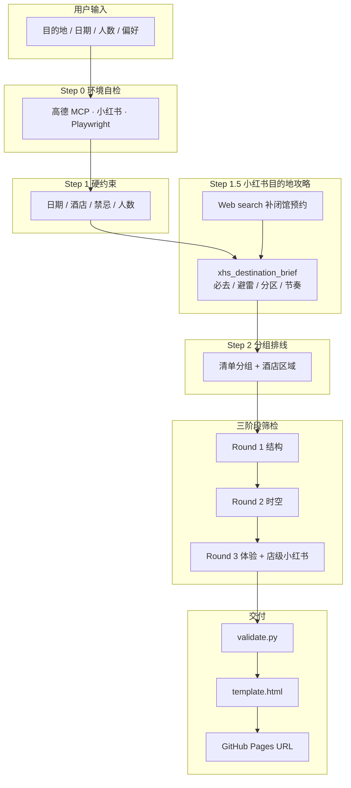

<div align="center">

# travel-planner

**用 AI 做真正能带出门的旅行方案 —— 交付物是一个手机点开就能看的行程网页**

[](https://github.com/SquirrelSong5/travel-planner-skill/stargazers)
[](https://github.com/SquirrelSong5/travel-planner-skill/network/members)
[](https://github.com/SquirrelSong5/travel-planner-skill/actions/workflows/validate.yml)
[](LICENSE)
[](CHANGELOG.md)

[在线预览](https://squirrelsong5.github.io/travel-plans/xiamen-2026-06-25.html) ·
[快速开始](#-快速开始) ·
[文档索引](#-文档) ·
[更新日志](CHANGELOG.md)

</div>

---

面向 **国内行程** 的 AI Agent Skill。不是输出 Markdown 或 PDF，而是调研真实 POI / 路线 / 餐厅后，生成**单文件 HTML** 并部署到 **GitHub Pages**，返回可分享的 URL。

数据源：**高德 MCP** + **[小红书 Step 1.5 目的地攻略](references/xhs-research.md#0-step-15目的地攻略必做前置)** + **美团攻略 WebFetch** + Round 3 店级避雷。大众点评因反爬过严，**已废弃不用**。

---

## 目录

- [亮点](#-亮点)
- [在线预览](#-在线预览)
- [工作原理](#-工作原理)
- [快速开始](#-快速开始)
- [环境依赖](#-环境依赖)
- [功能](#-功能)
- [文档](#-文档)
- [开发者](#-开发者)
- [常见问题](#-常见问题)
- [参与贡献](#-参与贡献)
- [相关项目](#-相关项目)
- [Star History](#star-history)
- [许可证](#-许可证)

---

## 亮点

| | |
|:---:|:---|
| **可分享的网页** | 唯一交付物 = GitHub Pages URL，手机 / 电脑浏览器直接打开 |
| **真实数据驱动** | POI、通勤时间来自高德 MCP；路线 polyline 来自 REST `/v3/direction/*`（MCP 常无坐标）；禁止凭模型记忆编造 |
| **攻略前置** | **v2.3.0**：Step 1.5 先搜小红书目的地攻略（必去/避雷/分区），再分组排线；Round 3 只做店级验证 |
| **开箱引导** | Step 0 自动自检环境，缺高德 / 小红书时 AI 带着装，不用先啃教程 |
| **可迭代** | 对话里改景点、加一天、换酒店 → 重校验、重渲染、重新部署 |
| **花销可视化** | 每时间段批注汇总门票 / 交通 / 餐饮；逛街等支持用户自填预算 |
| **质量门禁** | `validate.py` V1–V11 分轮校验，浏览器端二次重算防 AI 自嗨 |

---

## 在线预览

| 行程 | 链接 | 说明 |
|------|------|------|
| 青岛 4 天 3 晚 | [qingdao-2026-06-25.html](https://squirrelsong5.github.io/travel-plans/qingdao-2026-06-25.html) | 毕业游 · 栈桥/啤酒博物馆/八大关 |
| 厦门 4 天 3 晚 | [xiamen-2026-06-25.html](https://squirrelsong5.github.io/travel-plans/xiamen-2026-06-25.html) | 含地图、Tab 日程、段花销批注、抽屉酒店/提前订 |

> 交互地图需在 URL 后加 `?k=你的高德WebKey`（[说明](#网页地图-key交付后)）。不配 Key 也可正常浏览文字行程与花销。

---

## 工作原理



---

## 快速开始

### 安装 Skill

```bash
git clone https://github.com/SquirrelSong5/travel-planner-skill.git \
  ~/.claude/skills/travel-planner
```

> Cursor / Hermes / Codex 等路径见 [setup-guide.md](references/setup-guide.md#客户端适配)。

### 开聊即可

```
帮我做个厦门 4 天 3 晚行程，3 个人
```

**之后交给 AI。** 典型对话：

```
你 → 帮我做个厦门行程
AI → 🔍 环境自检
AI → （缺什么就带着装：高德 Key、小红书扫码…）
AI → 问硬约束 → **小红书目的地攻略（Step 1.5）** → 分组排线 → 三阶段规划 → validate → 渲染 HTML → 部署 → 给你 URL
```

零配置想先看效果？说 **「先用 demo 演示」** → AI 渲染内置 [成都示例](examples/chengdu-3d.json)。

### Step 1.5 做什么？（v2.3.0）

在分组排线**之前**，AI 会：

1. 搜小红书「`{城市} {N}天 攻略`」「`{城市} 避雷`」等，精读 3–5 篇
2. 并行 Web search 补闭馆、预约、季节信息
3. 产出 **`xhs_destination_brief`**（写入 `tripData` 可选字段）：
   - **必去** / **避雷** / **建议分区** / **节奏提示**
4. Step 2 分组与 Round 1 POI 池**必须对照 brief**，`must_visit` 未纳入须说明原因

未装 [xiaohongshu-skills](https://github.com/autoclaw-cc/xiaohongshu-skills) 时降级 WebFetch + Web search，并在 brief 标注 `degraded: true`。详见 [xhs-research.md §0](references/xhs-research.md)。

---

## 环境依赖

| 组件 | 级别 | 说明 |
|------|------|------|
| AI 客户端 + 本 Skill | 必需 | Claude Code / Cursor / Codex / Hermes 等 |
| [高德地图 MCP](https://lbs.amap.com/) | 必需 | POI、路线、天气；Step 0 引导配置 |
| [Playwright MCP](https://github.com/microsoft/playwright-mcp) | 装环境时推荐 | 有它 AI 可代填注册表单，省大量手动步骤 |
| [xiaohongshu-skills](https://github.com/autoclaw-cc/xiaohongshu-skills) | 推荐 | **Step 1.5 目的地攻略** + Round 3 店级避雷；未装则降级 WebFetch |
| 美团攻略 | 推荐 | 零装，AI 直接 WebFetch |
| `gh` CLI | 部署时 | 发布 GitHub Pages |
| 高德 Web JS Key | 可选 | 仅最终网页里的交互地图 |

<details>
<summary><strong>为什么不用大众点评？</strong></summary>

平台反爬（签名 / 滑块 / 指纹）极严，OpenCLI / Playwright 直抓基本不可用。**v1.2.0 起已废弃**。餐厅筛选靠高德 `maps_search_detail` + 美团攻略 + 小红书即可。

</details>

---

## 功能

<details open>
<summary><strong>行程页（template.html）</strong></summary>

- 按天 Tab + 高德地图 POI / 路网路线
- 时间段右侧**花销批注**（门票、交通、餐饮、逛街自填）
- 侧栏抽屉：酒店、提前订、天气策略、花销汇总
- 响应式：桌面批注 / 平板折叠 / 手机底部抽屉

</details>

<details>
<summary><strong>规划引擎（SKILL.md + references/）</strong></summary>

- 三阶段分轮筛检：结构 → 时空 → 体验
- **Step 1.5 小红书目的地攻略**（v2.3.0 必做，先于分组）
- 增量修改协议：换点、加天、改酒店不必重头做
- 国内 OTA 深链（`flights.ctrip.com` 等），校验拦截 Trip.com 国际版（V11）
- 价格调研 + `slot_costs` 智能枚举 + V10 溯源

</details>

---

## 文档

| 文档 | 内容 |
|------|------|
| [SKILL.md](SKILL.md) | AI 主流程（Step 0–7，含 **Step 1.5**） |
| [setup-guide.md](references/setup-guide.md) | 环境配置、7 客户端适配 |
| [planning.md](references/planning.md) | 规划方法论、OTA 链接规范 |
| [amap-mcp-usage.md](references/amap-mcp-usage.md) | 高德 MCP 调用模式 |
| [price-research.md](references/price-research.md) | 价格调研与 `slot_costs` |
| [validation-rules.md](references/validation-rules.md) | V1–V11 规则说明 |
| [iteration-rounds.md](references/iteration-rounds.md) | 三阶段分轮筛检 |
| [multi-turn-protocol.md](references/multi-turn-protocol.md) | 增量修改、对话协议 |
| [xhs-research.md](references/xhs-research.md) | 小红书调研（**§0 Step 1.5 目的地攻略** + 店级两段式） |
| [meituan-guide-research.md](references/meituan-guide-research.md) | 美团攻略 WebFetch |
| [examples/README.md](examples/README.md) | tripData JSON Schema |

---

## 开发者

### 项目结构

```
travel-planner/
├── SKILL.md                 # Agent 入口
├── assets/template.html     # 单文件行程页模板
├── scripts/
│   ├── validate.py          # V1–V13 校验
│   ├── render_html.py       # JSON → HTML
│   ├── add_hotel_legs.py    # 酒店早晚通勤（idx=0）
│   └── seed_prices.py       # 示例价格回填
├── examples/chengdu-3d.json   # 国内 demo
└── references/                # 规划与集成文档
```

### 本地命令

```bash
# 校验示例
python3 scripts/validate.py examples/chengdu-3d.json --pretty

# 分轮校验
python3 scripts/validate.py trip.json --round 1

# 渲染 HTML
python3 scripts/render_html.py assets/template.html trip.json -o out.html
```

### 网页地图 Key（交付后）

规划用 MCP Key ≠ 网页地图 Key。要看交互地图时：

1. 高德控制台申请 **Web 端 (JS API)** Key
2. 白名单填 `你的用户名.github.io`
3. 访问 `行程页.html?k=你的Key`（勿写入 git）

---

## 常见问题

<details>
<summary><strong>小红书 Step 1.5 和 Round 3 有什么区别？</strong></summary>

| | Step 1.5 | Round 3 |
|---|----------|---------|
| **时机** | Step 1 后、分组前 | 三阶段第 3 轮 |
| **搜索词** | `{城市} N天攻略` / `避雷` | `{店名} 排队` / `踩雷` |
| **产出** | `xhs_destination_brief` | POI `note` / `meals` 软信号 |
| **目的** | 定分区、必去、避雷 | 验证具体餐厅/景点体验 |

</details>

<details>
<summary><strong>我要先自己配好高德和小红书吗？</strong></summary>

不用。装好 Skill 直接开聊，Step 0 会检测并引导；也可先说「demo 演示」跳过。

</details>

<details>
<summary><strong>和「自己 ChatGPT 写攻略」有什么区别？</strong></summary>

本 Skill 强制走 MCP 实查 + 脚本校验 + 固定 HTML 交付物，减少幻觉和「排太满 / 路线不现实」；产出是可分享网页而非聊天里的长文。

</details>

<details>
<summary><strong>为什么不用 Trip.com？</strong></summary>

国内行程用携程子域深链（`flights.ctrip.com` 等）。`trip.com` 是国际站，V11 校验会拦截。

</details>

<details>
<summary><strong>PDF 可以吗？</strong></summary>

正式交付物是网页 URL。可自行浏览器打印为 PDF。

</details>

---

## 参与贡献

欢迎 Issue 与 Pull Request：

- 改进 `template.html` 移动端体验
- 补充国内城市 `examples/`
- 完善文档或校验规则

提交前建议：

```bash
python3 scripts/validate.py examples/chengdu-3d.json --pretty
```

---

## 相关项目

| 项目 | 说明 |
|------|------|
| [xiaohongshu-skills](https://github.com/autoclaw-cc/xiaohongshu-skills) | 小红书 CLI（推荐搭配） |
| [trip-map-builder](https://github.com/hiyeshu/trip-map-builder) | 「参考坐标」规划理念（MIT） |
| [高德开放平台](https://lbs.amap.com/) | 地图与 POI 数据 |

---

## Star History

[](https://star-history.com/#SquirrelSong5/travel-planner-skill&Date)

---

## 许可证

[MIT License](LICENSE)

行程中的 POI、价格等来自第三方实时查询，**仅供参考**；出行请以官方与平台实时信息为准。

---

<div align="center">

**如果这个项目帮你省下了做攻略的时间，欢迎 [Star ⭐](https://github.com/SquirrelSong5/travel-planner-skill)**

</div>
